# 🎮 Minecraft AWS Infrastructure & Server Setup

This project provides a comprehensive, script-based automation suite to deploy a highly available and cost-efficient Minecraft server on AWS. It includes automated infrastructure provisioning, a proxy layer for traffic management, and support for both **Vanilla** and **Forge** server types.

## 🏗 Architecture Overview

The system follows a tiered architecture for security and scalability:

- **VPC Layer:** A dedicated Virtual Private Cloud with Public and Private subnets.
- **Proxy Server (Public Subnet):** A lightweight Node.js proxy that handles initial player connections and can interact with the AWS API to manage the Minecraft server state.
- **Minecraft Server (Private Subnet):** The actual game server, isolated from the public internet, receiving traffic only through the proxy.

```mermaid
architecture-beta
    group vpc(logos:aws-vpc)[Main VPC]
    group public_subnet(cloud)[Public Subnet] in vpc
    group private_subnet(cloud)[Private Subnet] in vpc

    service proxy(logos:aws-ec2)[Proxy Server] in public_subnet
    service mc_server(logos:aws-ec2)[Minecraft EC2] in private_subnet

    service internet(internet)[Internet Gateway]
    internet:B -- T:proxy
    proxy:R -- L:mc_server
```



---

## 🛠 Project Structure

| Directory/File | Description |
| :--- | :--- |
| `infra/` | AWS infrastructure scripts, configuration (`awsConfig.json`), and SSH keys. |
| `scripts/` | Installation scripts for the Minecraft server and Proxy. |
| `docs/` | Architecture diagrams and documentation. |
| `backups/` | Storage for server backups and snapshots. |
| `README.MD` | Project documentation and quick start guide. |
| `.gitignore` | Prevents sensitive keys and heavy game files from being committed. |

---

## 🚀 Quick Start Guide

### 1. Prerequisites
- [AWS CLI](https://aws.amazon.com/cli/) installed and configured (`aws configure`).
- SSH Key Pair named `mcServer-kp`.

### 2. Provision Infrastructure
Run the infrastructure script to create the VPC and launch the EC2 instances.
```bash
./infra/setupAWSInfrastructure.sh
```
*Note: This script will output the Public IPs of your instances.*

### 3. Setup the Proxy Server
SSH into your Proxy instance and run:
```bash
./scripts/setupProxy-mcServer.sh
```

### 4. Setup the Minecraft Server
SSH into your Minecraft instance. Run the main setup script and choose your server type:
```bash
./scripts/setupMain-mcServer.sh
```
- **Option 1:** Vanilla (High performance, latest versions).
- **Option 2:** Forge (For modded gameplay).

---

## ⚙️ Configuration details

### Minecraft Server Management
The server is managed by **systemd**. You can control it using standard service commands:
- **Start:** `sudo systemctl start vanilla-minecraft` (or `forge-minecraft`)
- **Stop:** `sudo systemctl stop vanilla-minecraft`
- **Status:** `sudo systemctl status vanilla-minecraft`

### Cost Optimization
To save money, use the following AWS CLI commands to stop the instances when not in use:
```bash
# Stop the Minecraft Instance
aws ec2 stop-instances --instance-ids $(jq -r '.[1]."aws-servers-ids"."minecraft-server-id"' awsConfig.json)
```

---

## 🛡 Security Note
- The Minecraft server resides in a **Private Subnet**.
- Access is restricted via **Security Groups** to only allow traffic on port `25565` from the Proxy and port `22` for administration.
- Always keep your `.pem` key files secure and never commit them to public repositories.

---

## 📜 License
MIT License. Feel free to modify and adapt for your own server needs!
