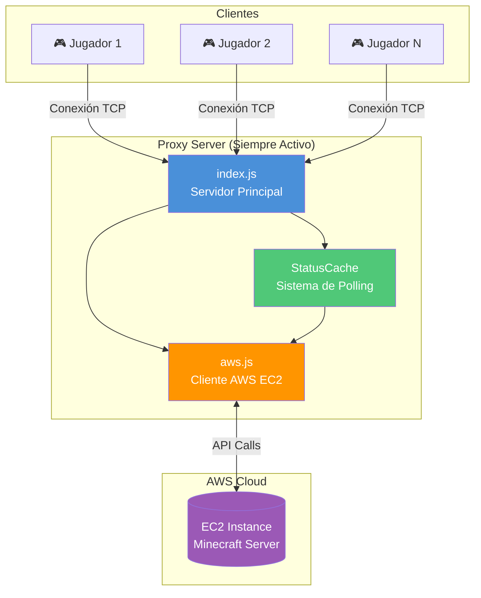
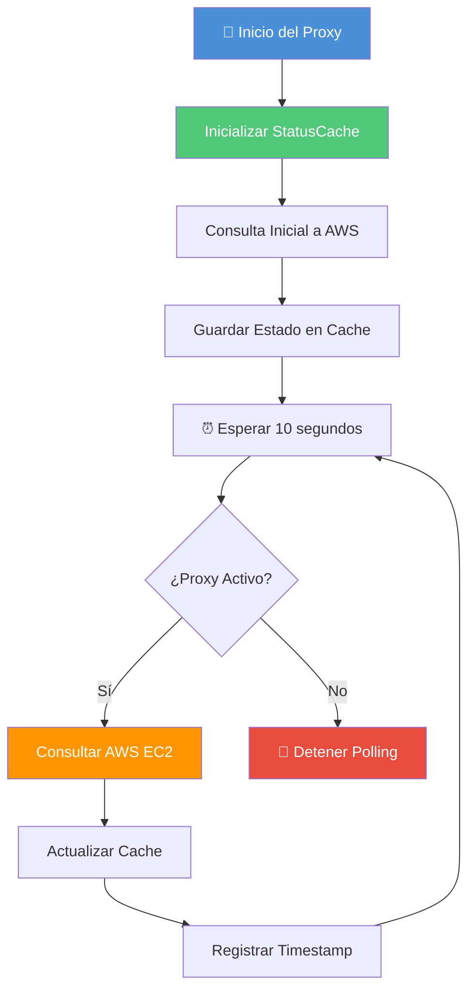
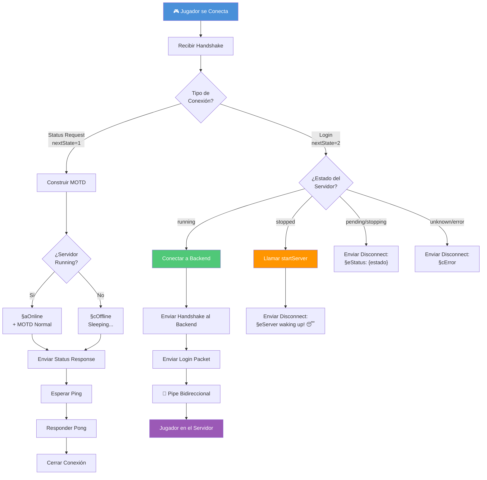
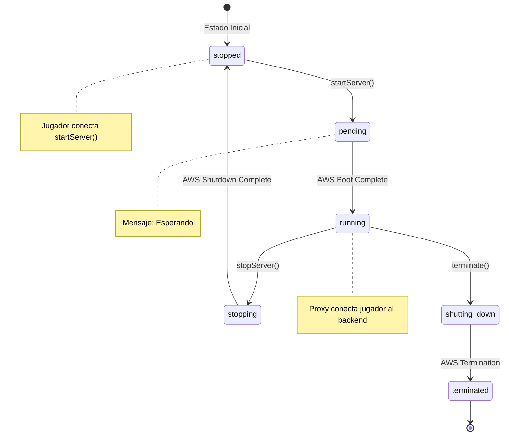
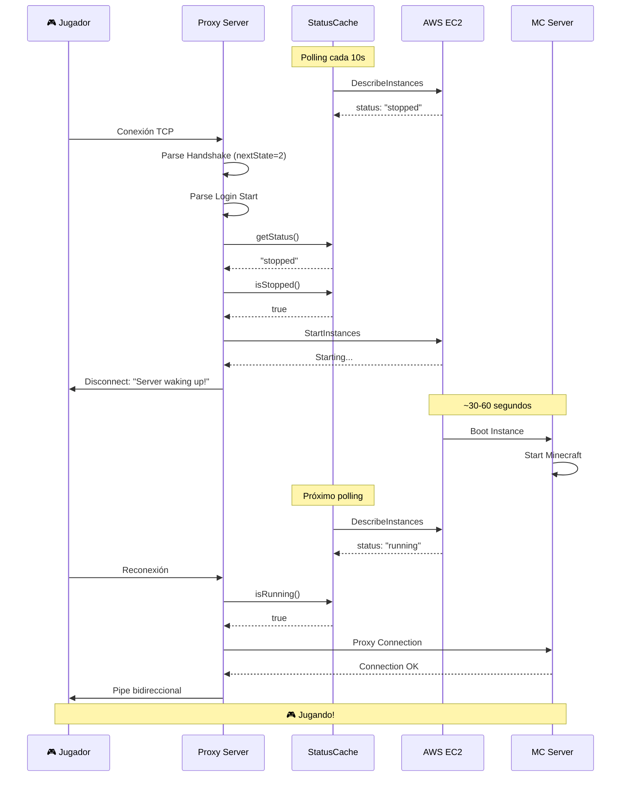

# Sistema de Monitoreo del Proxy Server

Documentación técnica del sistema de monitoreo que permite al Proxy Server mantener control sobre el estado del servidor de Minecraft (encendido/apagado).

---

## 📋 Índice

1. [Visión General](#visión-general)
2. [Arquitectura del Sistema](#arquitectura-del-sistema)
3. [Componentes](#componentes)
4. [Diagramas de Flujo](#diagramas-de-flujo)
5. [Configuración](#configuración)
6. [API de Referencia](#api-de-referencia)

---

## Visión General

El sistema de monitoreo implementa un patrón de **polling** que consulta el estado de la instancia EC2 de AWS cada 10 segundos. Esto permite al proxy:

- ✅ Mostrar el estado real del servidor en el MOTD (Message of the Day)
- ✅ Encender automáticamente el servidor cuando un jugador intenta conectarse
- ✅ Proxy transparente del tráfico cuando el servidor está encendido
- ✅ Mostrar mensajes informativos durante estados de transición

---

## Arquitectura del Sistema



---

## Componentes

### 1. `src/aws.js` - Cliente AWS EC2

Módulo que encapsula todas las operaciones con AWS EC2.

| Función             | Parámetros           | Retorno            | Descripción                              |
| ------------------- | -------------------- | ------------------ | ---------------------------------------- |
| `getServerStatus()` | `instanceId: string` | `Promise<string>`  | Obtiene el estado actual de la instancia |
| `startServer()`     | `instanceId: string` | `Promise<boolean>` | Inicia la instancia EC2                  |
| `stopServer()`      | `instanceId: string` | `Promise<boolean>` | Detiene la instancia EC2                 |

**Estados posibles de EC2:**

- `running` - Servidor encendido y operativo
- `stopped` - Servidor apagado
- `pending` - Servidor iniciándose
- `stopping` - Servidor apagándose
- `shutting-down` - Servidor terminándose
- `terminated` - Servidor terminado
- `unknown` - Error al consultar estado
- `notFound` - Instancia no encontrada

---

### 2. `src/utils/status-cache.js` - Sistema de Caché y Polling

Implementa el patrón Singleton para mantener un cache centralizado del estado del servidor.

#### Clase `StatusCache`

```javascript
class StatusCache {
    constructor(instanceId, pollIntervalMs = 10000)
    start()           // Inicia el polling
    stop()            // Detiene el polling
    update()          // Fuerza actualización inmediata
    getStatus()       // Retorna estado cacheado
    isRunning()       // true si status === 'running'
    isStopped()       // true si status === 'stopped'
    getAge()          // ms desde última actualización
}
```

#### Funciones Exportadas

| Función                                       | Descripción                        |
| --------------------------------------------- | ---------------------------------- |
| `initStatusCache(instanceId, pollIntervalMs)` | Inicializa el singleton            |
| `getStatusCache()`                            | Obtiene la instancia del singleton |

---

### 3. `src/index.js` - Servidor Proxy Principal

Orquesta todo el sistema y maneja las conexiones de los jugadores.

**Flujo de Estados del Protocolo:**

| Estado                | Valor | Descripción                                         |
| --------------------- | ----- | --------------------------------------------------- |
| `HANDSHAKE`           | 0     | Esperando handshake inicial                         |
| `WAIT_STATUS_REQUEST` | 2     | Esperando solicitud de estado (lista de servidores) |
| `WAIT_PING`           | 4     | Esperando ping para responder pong                  |
| `WAIT_LOGIN`          | 3     | Esperando intento de login (conexión real)          |

---

## Diagramas de Flujo

### Flujo de Monitoreo (Polling)



---

### Flujo de Conexión de Jugador



---

### Flujo de Estados del Servidor EC2



---

### Secuencia de Inicio Automático



---

## Configuración

### Archivo `config.json`

```json
{
  "region": "us-east-1",
  "proxy_port": 25599,
  "backend": {
    "fabric": {
      "instanceId": "i-xxxxxxxxxxxxxxxxx",
      "host": "ec2-xx-xx-xx-xx.compute-1.amazonaws.com",
      "port": 25565
    }
  },
  "motd": {
    "line1": "§5§lPurple Kingdom",
    "line2": "§7Welcome to the server!"
  }
}
```

### Variables de Entorno (Opcional)

```bash
AWS_REGION=us-east-1
AWS_ACCESS_KEY_ID=your-access-key
AWS_SECRET_ACCESS_KEY=your-secret-key
```

---

## API de Referencia

### Inicialización del StatusCache

```javascript
const { initStatusCache } = require("./utils/status-cache");

// Inicializa con polling cada 10 segundos (default)
const statusCache = initStatusCache("i-1234567890abcdef0");

// O con intervalo personalizado (5 segundos)
const statusCache = initStatusCache("i-1234567890abcdef0", 5000);
```

### Uso del StatusCache

```javascript
// Obtener estado actual
const status = statusCache.getStatus();
// Posibles valores: 'running', 'stopped', 'pending', 'stopping', 'unknown'

// Verificar si está corriendo
if (statusCache.isRunning()) {
  // Conectar jugador al backend
}

// Verificar si está detenido
if (statusCache.isStopped()) {
  // Iniciar servidor
  startServer(instanceId);
}

// Obtener antigüedad del cache
const ageMs = statusCache.getAge();
console.log(`Última actualización hace ${ageMs}ms`);
```

### Control del Servidor

```javascript
const { startServer, stopServer, getServerStatus } = require("./aws");

// Encender servidor
await startServer("i-1234567890abcdef0");

// Apagar servidor
await stopServer("i-1234567890abcdef0");

// Consulta directa (sin cache)
const status = await getServerStatus("i-1234567890abcdef0");
```

---

## Notas Técnicas

> [!IMPORTANT]
> El intervalo de polling de 10 segundos es un balance entre:
>
> - **Responsividad**: Detectar cambios de estado rápidamente
> - **Costo**: Minimizar llamadas a la API de AWS (son gratuitas pero tienen rate limits)

> [!TIP]
> Para depuración, puedes reducir el intervalo temporalmente:
>
> ```javascript
> const statusCache = initStatusCache(instanceId, 3000); // 3 segundos
> ```

> [!WARNING]
> El sistema asume que hay una única instancia del proxy. Si ejecutas múltiples proxies apuntando al mismo servidor, podrían haber conflictos de arranque.

---

## Archivos Relacionados

| Archivo           | Ubicación                         | Descripción               |
| ----------------- | --------------------------------- | ------------------------- |
| `aws.js`          | `proxy/src/aws.js`                | Cliente AWS EC2           |
| `status-cache.js` | `proxy/src/utils/status-cache.js` | Sistema de polling        |
| `index.js`        | `proxy/src/index.js`              | Servidor proxy principal  |
| `config.json`     | `proxy/config.json`               | Configuración del sistema |
