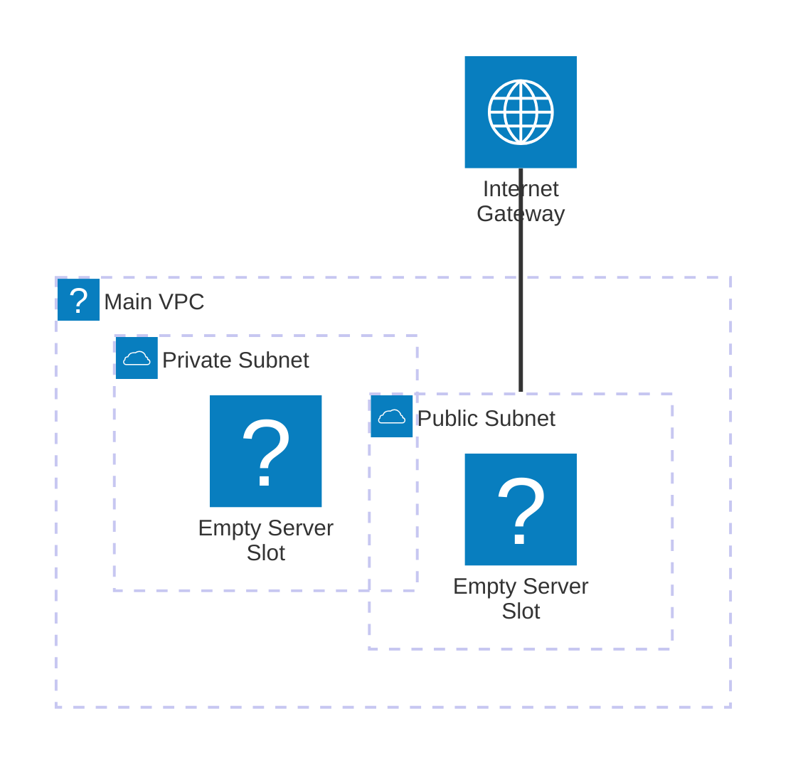

```mermaid
architecture-beta
    %% --- Definitions ---
    %% 1. The Main Container: The VPC
    %% We use the official AWS VPC icon for the group
    group vpc(logos:aws-vpc)[Main VPC]

    %% 2. The Subnets placed INSIDE the VPC group
    %% We use generic cloud icons for subnets as they are just containers
    group public_subnet(cloud)[Public Subnet] in vpc
    group private_subnet(cloud)[Private Subnet] in vpc

    %% --- Content ---
    %% 3. The "Empty" Servers
    %% Mermaid needs nodes to render the groups. We add placeholder EC2s.
    service pub_server_slot(logos:aws-ec2)[Empty Server Slot] in public_subnet
    service priv_server_slot(logos:aws-ec2)[Empty Server Slot] in private_subnet

    %% Optional: Show internet connectivity intent to the public subnet
    service internet(internet)[Internet Gateway]
    internet:B -- T:pub_server_slot{group}
```